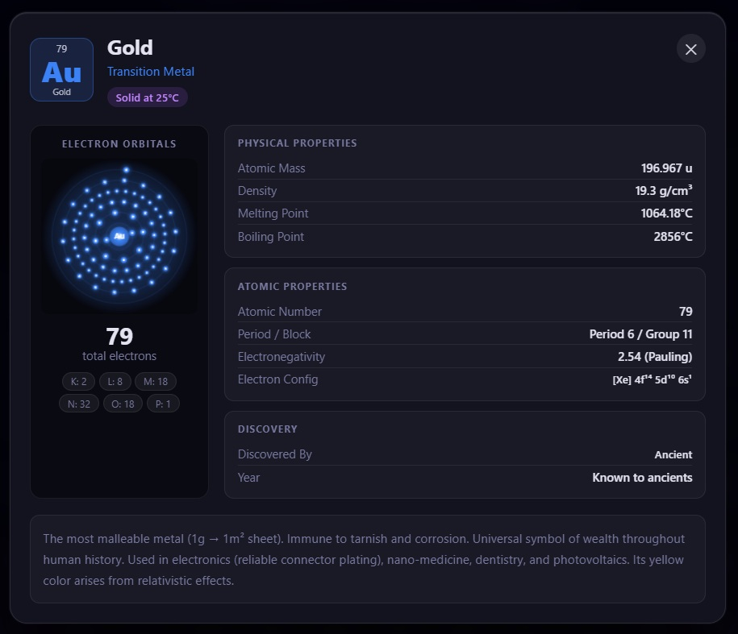

# ⚛️ Interactive Periodic Table

A beautiful, fully interactive periodic table built with pure **HTML, CSS, and JavaScript** — no frameworks, no dependencies. Click any element to watch its electrons orbit the nucleus in real time and explore detailed information about every element in the universe.

> 🎵 **This is a vibe coded project** — built entirely through natural language prompts using AI, with zero manual coding. Every element, every animation, every glowing orbital was described in plain English and brought to life by AI. Pure vibes, pure science.

---

## 🌐 Live Demo

👉 **[View Live on GitHub Pages](https://abyshergill.github.io/Periodic_Table/)**

> Replace the link above with your actual hosted URL after deployment.

---

## 📸 Preview

| Periodic Table View | Element Detail Card |
|---|---|
| All 118 elements color-coded by category | Animated electron orbitals + full properties |


---

## ✨ Features

- 🔬 **All 118 Elements** — complete periodic table with correct grid layout, including lanthanide and actinide rows
- 🌀 **Live Electron Orbital Animation** — canvas-based animation showing electrons spinning in real shells around the nucleus
- 📋 **Detailed Element Cards** — physical properties, atomic data, discovery history, and rich descriptions
- 🎨 **11 Color-Coded Categories** — Alkali Metals, Noble Gases, Lanthanides, Actinides, and more
- 🌌 **Deep Space Theme** — immersive dark UI with glowing hover effects per element category
- 🔡 **Shell Configuration Labels** — K, L, M, N, O, P, Q shells with exact electron counts
- 💧 **State Badges** — displays whether each element is a Gas, Liquid, or Solid at room temperature
- ⌨️ **Keyboard Accessible** — press `Esc` or click outside the card to close it
- 📄 **PDF Export** — print or export the table directly from the browser
- 📱 **Responsive Design** — works on desktop, tablet, and mobile screens

---

## 🚀 Getting Started

### Option 1 — Open Locally

```bash
# Clone the repository
git clone https://github.com/your-username/your-repo-name.git

# Navigate into the folder
cd your-repo-name

# Open in your browser
open index.html
```

### Option 2 — Host on GitHub Pages

1. Push this repository to GitHub
2. Go to **Settings → Pages**
3. Under **Source**, select `main` branch and `/ (root)`
4. Click **Save** — your site will be live in a few seconds

---

## 🧒 What Children Can Learn

This interactive periodic table is designed to make chemistry **visual, engaging, and fun** for learners of all ages. Here is what children can explore and discover:



### 🔢 Numbers & Atomic Structure
- Every element has a unique **atomic number** — the number of protons in its nucleus
- The **electron shells** (K, L, M, N…) fill up in a specific order as elements get heavier
- Lighter elements like Hydrogen (1 electron) look simple, while heavy elements like Oganesson (118 electrons) have many busy orbiting shells — children can **see this difference visually**

### 🌀 How Electrons Move
- The animated orbital view shows electrons **rotating around the nucleus** in real time
- Children learn that electrons live in **layers called shells**, not random clouds
- They can compare how many shells Lithium (2 shells) has versus Caesium (6 shells), building intuition for **periodic trends**

### 🗂️ How Elements are Grouped
- The **color-coded categories** teach children to distinguish metals, non-metals, and metalloids at a glance
- They learn why certain elements (Noble Gases) don't react with others, while Alkali Metals react explosively with water
- Group and period patterns — like reactivity increasing down a column — become easy to observe

### 🔬 States of Matter
- Each element card shows whether the element is a **solid, liquid, or gas** at room temperature
- Children discover surprising facts — Bromine and Mercury are the only elements liquid at room temperature, Helium never becomes solid under normal pressure

### 📖 Element Stories & History
- Every element has a **discovery story** — who found it, when, and how
- Children read about Marie Curie discovering Polonium and Radium, or how Neon got its name from the Greek word for "new"
- Stories of elements found in meteorites, volcanoes, and the sun make **science feel like an adventure**

### 🌍 Real-World Connections
- Children connect elements to everyday objects — Silicon in phones and computers, Iron in blood, Carbon in all living things
- They learn where elements come from: the ocean (Bromine), the atmosphere (Nitrogen, Oxygen), the Earth's crust (Aluminium, Silicon)
- Understanding which elements power batteries, solar panels, and medicines builds **science literacy for the modern world**

### ⚖️ Physical Properties & Measurement
- Melting points, boiling points, and density introduce children to **scientific units and measurement**
- Comparing properties — why is Tungsten used in light bulb filaments? Because it has the **highest melting point** of all metals — teaches critical thinking

### 🔤 Scientific Language
- Children naturally pick up terms like **atomic mass, electronegativity, electron configuration, and isotope** through exploration
- The **element symbols** (Fe for Iron from Latin *Ferrum*, Au for Gold from *Aurum*) open doors to **Latin and etymology**

### 🌌 The Scale of the Universe
- Elements like Hydrogen and Helium make up **99% of the universe** — children grasp just how vast and simple the cosmos is at its core
- Superheavy elements (104–118) exist for only milliseconds and were made in laboratories, sparking curiosity about **cutting-edge science**

---

## 🛠️ Built With

| Technology | Purpose |
|---|---|
| HTML5 | Structure and layout |
| CSS3 | Styling, animations, responsive design |
| JavaScript (Vanilla) | Interactivity, canvas-based electron animation |
| Canvas API | Real-time electron orbital rendering |

---

## 📁 Project Structure

```
your-repo-name/
│
├── css/style.css     # Style for UI
├── js/scirpt.js      # Javascript for render electron and UI behave
├── index.html        # The entire application (single file)
└── README.md         # This file
```

---

## 🤝 Contributing

Pull requests are welcome! If you'd like to improve the element data, add new features, or enhance the UI, feel free to fork the repo and submit a PR.

---

## 📜 License

This project is open source and available under the [MIT License](LICENSE).

---

<p align="center">Made with ❤️ for curious minds everywhere</p>
